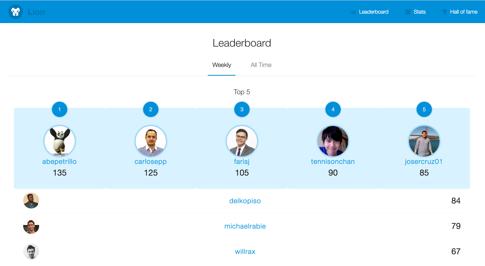
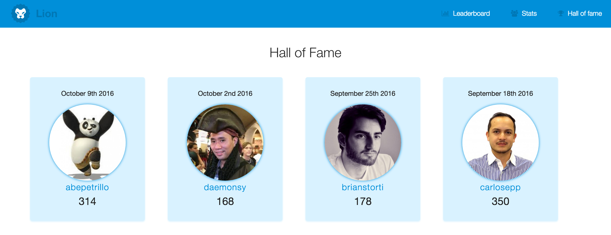
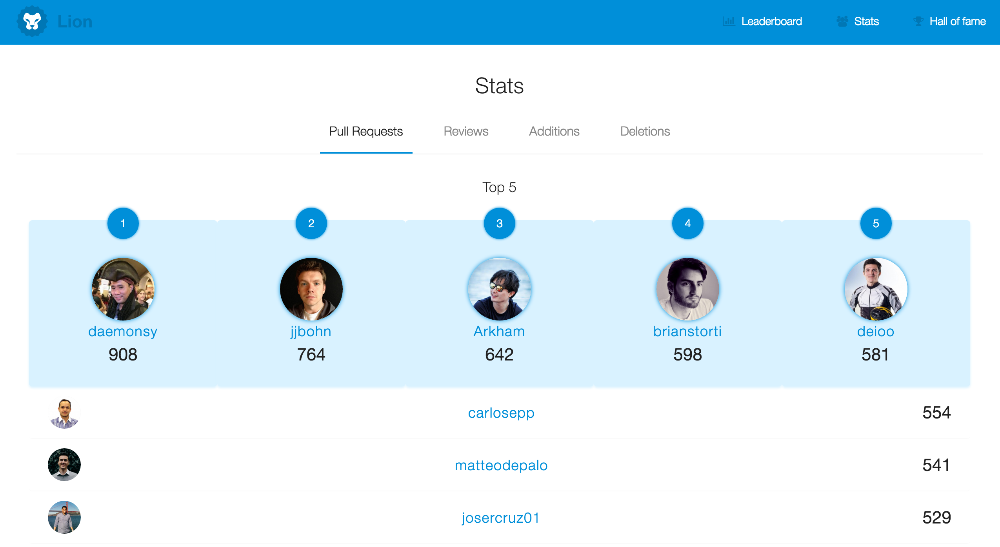

# Lion

Lion is a dashboard for developers written with Ember and Rails.
It rewards developers when they get shit done®.

This is the web client. [Here](https://github.com/alphasights/lion-api) you can find the API.

## Installation

#### Prerequisites

You will need the following things properly installed on your computer.

```bash

# Install with Homebrew
$ brew install node

# Bower and ember-cli
$ npm install -g bower ember-cli
```

### Setup

* `git clone` this repository
* `npm install`
* `bower install`

## Running

Before running the server make sure you have [lion-api](https://github.com/alphasights/lion-api) running in a separate terminal on `localhost:3000`. You can run the lion-api server with `rails server`.

* `ember server`
* Visit your app at http://localhost:4200.

## Running Tests

* `ember test`
* `ember test --server`

## Building

* `ember build`

## Leaderboard



## Hall of Fame



## Stats


